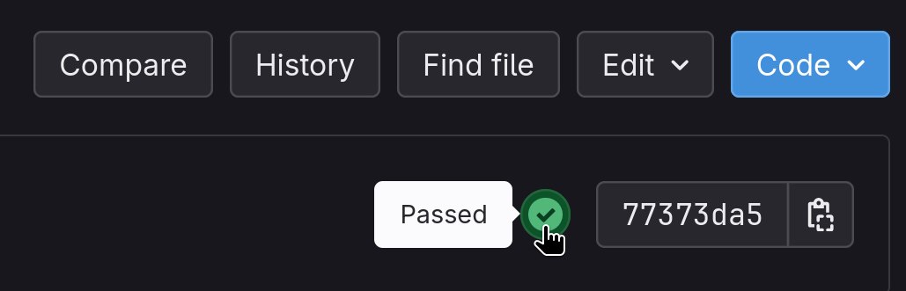
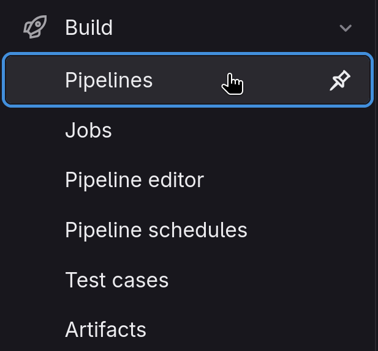

[[_TOC_]]

# BKS Introduction

Willkommen im GitLab-Repository zur Vorlesung Betriebs- und Kommunikationssysteme (BKS). In diesem Repository finden Sie den Programmierteil der Übungsaufgaben, ergänzendes Material, Lektionen sowie weitere Lehrinhalte rund um das Thema BKS.

Sie befinden sich derzeit im `main`-Branch dieses Projekts. Im Folgenden wird die Struktur des Repositories erläutert, auf besondere Aspekte hingewiesen und auf zahlreiche wichtige Links sowie weitere Branches verwiesen.

Bitte nehmen Sie sich die Zeit, diese Einführung sorgfältig durchzulesen, bevor Sie Fragen stellen.

---

# Was ist GitLab?

Um nachvollziehen zu können, wo Aufgaben und weiteres Material zu finden sind, ist ein grundlegendes Verständnis von Git und GitLab hilfreich. Dieses Kapitel kann jedoch bei vorhandenem Vorwissen übersprungen werden.

- **Git**:  
  Git ist ein verteiltes Versionskontrollsystem, das es Entwicklerinnen und Entwicklern ermöglicht, Änderungen an Dateien – insbesondere Quellcode – nachzuvollziehen, zu verwalten und gemeinsam daran zu arbeiten. Es unterstützt die Arbeit mit verschiedenen Entwicklungszweigen (_Branches_) und ermöglicht es, jederzeit zu einem früheren Stand des Projekts zurückzukehren.

  Änderungen können zunächst in separaten Branches umgesetzt werden, ohne den Code im `main`-Branch zu beeinflussen. Sobald ein Feature oder eine Änderung fertiggestellt und getestet wurde, kann es in den Hauptbranch integriert werden.  

  Git ist ein essenzielles Werkzeug in der Softwareentwicklung. Auch wenn es anfangs ungewohnt oder komplex erscheint, lohnt es sich, den Umgang damit zu erlernen – in der Praxis ist es unverzichtbar. Für die Bearbeitung der BKS-Aufgaben wird ein grundlegendes Verständnis von Git vorausgesetzt. Dieses Wissen kann mithilfe des Git-Einsteiger-Guides [hier](https://git.imp.fu-berlin.de/bks-tuts/bks-exercises/-/wikis/Git-Guide) erarbeitet oder aufgefrischt werden. Außerdem sind zahlreiche Informationen und Tutorials im Internet zu finden.

- **GitLab**:  
  GitLab ist eine webbasierte Plattform zur Verwaltung von Git-Repositories. Nachdem Code lokal entwickelt wurde, kann er in ein sogenanntes _Remote Repository_ hochgeladen (_gepusht_) werden – zum Beispiel auf Plattformen wie GitLab oder GitHub. Von dort aus können berechtigte Nutzerinnen und Nutzer den Code herunterladen (_pullen_) und weiterentwickeln.

  Neben Funktionen wie Code-Verwaltung, Merge Requests und Branch-Management bietet GitLab integrierte Werkzeuge für Continuous Integration und Delivery (CI/CD), Projektmanagement, Wikis und mehr.  

  Für die Arbeit an diesem Projekt reicht es zunächst aus zu wissen, dass Sie sich aktuell in einem GitLab-Projekt mit mehreren Branches und Wiki-Seiten befinden. Weiterführende Informationen zu Git und GitLab finden Sie [hier](https://git.imp.fu-berlin.de/bks-tuts/bks-exercises/-/wikis/Git-Guide).

---

# Projektstruktur

Alle wichtigen Informationen und Ressourcen sind von diesem Projekt aus zugänglich. Der aktuelle Branch (`main`) enthält allgemeine Informationen.

**Übungsaufgaben:**  
Die Übungsaufgaben befinden sich jeweils in einem eigenen Branch innerhalb dieses Projekts. Diese Übungs-Branches sind aufsteigend nummeriert und folgen dem Format `uebung-##`. Die Branches `uebung-00x` gehören zur Einführung in die C-Programmierung.

---

# Bearbeitung der Übungsaufgaben

Die Übungsaufgaben bearbeiten Sie in einem eigenen GitLab-Projekt. Erstellen Sie dazu einen `Fork`, um alle Inhalte aus diesem Projekt in Ihr eigenes Repository zu übernehmen. Klonen Sie anschließend das Projekt lokal und wechseln Sie in den entsprechenden Übungs-Branch, den Sie bearbeiten möchten.

> [!important]  
> Da sich das Projekt aktuell noch im Aufbau befindet, kann es vorkommen, dass nach dem Erstellen Ihres Forks Änderungen veröffentlicht werden. Forks aktualisieren sich nicht automatisch!  
> Damit sich ihr Repository automatisch oder manuell aktualisieren kann muss ein Repository-Mirror eingerichtet werden [Mirror Repositories](#mirror-repositories) beschrieben. Sie finde eine Schritt für Schritt Anleitung folgend.

---

## Anforderungen

Die Übungsaufgaben beschäftigen sich mit der C-Programmierung. C ist eine systemabhängige Programmiersprache – das bedeutet: Nur weil der Code auf Tobis Laptop funktioniert, heißt das nicht, dass er auch auf Ronjas PC korrekt läuft. Ohne zu sehr ins Detail zu gehen: **An dieser Stelle endet die Nutzung von Windows-Systemen.**

Ihr Code wird auf einem der folgenden `x86_64`-Systeme getestet und muss daher auf diesen Plattformen lauffähig sein:

- Debian (GCC Base Image)  
- Alpine (GitLab Runner Base Image)  
- Fedora

Die Nutzung eines eigenen Linux-Systems wird ausdrücklich empfohlen. Welche Linux-Distro Sie verwenden sollte in der Regel keine Rolle spielen. Beispiele werden jedoch nur für Debian based und Fedora (Redhat) aufgeführt. Falls dies nicht möglich ist, stehen folgende Alternativen zur Verfügung:

- Andorra-System (Sehen Sie die Whiteboard-Lessons)  
- Pool-Rechner in der T9  
- Linux in einer virtuellen Maschine  
- [USB-Live-System](https://git.imp.fu-berlin.de/bks-tuts/bks-exercises/-/wikis/BKS-Wiki/USB-Live-System)

Ein Dual-Boot zwischen Windows und Linux ist nicht ideal und kann zu Problemen führen. Besitzen Sie jedoch einen USB-Stick (empfohlen: mindestens 16 GB), können Sie darauf ein Linux-System installieren, das unabhängig vom Windows-System direkt vom Stick gebootet werden kann. Weitere Informationen dazu finden Sie [hier](https://git.imp.fu-berlin.de/bks-tuts/bks-exercises/-/wikis/BKS-Wiki/USB-Live-System).

Insgesamt ist dieses Thema sehr gut dokumentiert – fünf Minuten Eigenrecherche können oft schon weiterhelfen.

Für den Übergang lassen sich einfache Übungen auch [online über GitLab](https://git.imp.fu-berlin.de/bks-tuts/bks-exercises/-/wikis/BKS-Wiki/Web-IDE) bearbeiten. Dies ist allerdings wenig komfortabel und sollte nur als kurzfristige Notlösung dienen.

## Korrektur mit CI-Pipeline

Für alle Übungsaufgaben existieren entsprechende CI-Pipelines (Continuous Integration), die Ihren Code automatisch testen. Sobald Sie einen Commit in Ihren Fork pushen, wird die Pipeline des jeweiligen Branches ausgeführt.

Ein erfolgreicher Durchlauf der Pipeline (alle Tests bestanden) wird durch ein **grünes Häkchen** am Commit angezeigt. Ein **rotes Kreuz** signalisiert, dass die Pipeline fehlgeschlagen ist.  

Ein **orangenes Ausrufezeichen (`!`)** weist auf das Fehlschlagen eines Tests hin, der fehlschlagen darf – z. B. ein Test für eine optionale Zusatzaufgabe. Ein **orangenes Pausensymbol** zeigt an, dass der aktuell zuständige GitLab Runner ausgelastet ist. In diesem Fall wird Ihr Job nach kurzer Wartezeit automatisch ausgeführt, sobald Ressourcen verfügbar sind.

Wenn Sie nicht möchten, dass die Pipeline ausgeführt wird (z. B. beim Push unvollständigen Codes oder während der Testentwicklung), können Sie dies verhindern, indem Sie `[skip ci]` oder `[ci skip]` – in beliebiger Groß- und Kleinschreibung – in Ihre Commit-Nachricht einfügen.

---

### Debugging mit Pipelines

Wenn Sie auf das Statussymbol des aktuellen Commits klicken

oder in der linken Seitenleiste unter `Build` → `Pipelines` die aktuelle Pipeline auswählen,

erhalten Sie eine Übersicht über alle ausgeführten Jobs, gegliedert nach ihren jeweiligen `Stages`.

Durch Klicken auf einen einzelnen Job erhalten Sie Zugriff auf den Log. Dieser enthält – je nach Job – Informationen wie Build-Fehler, erfolgreiche oder fehlgeschlagene Tests sowie weitere Hinweise zur Fehlersuche und zum Debuggen Ihres Codes.

---

## Fragen zum Code

Die Arbeit mit Git und GitLab erleichtert die Zusammenarbeit an Code und den Austausch mit Kommilitoninnen, Kommilitonen oder Tutor:innen.  

Wenn Sie Hilfe benötigen, fügen Sie die betreffende Person einfach als Developer zu Ihrem Repository hinzu. Geben Sie bei der Problembeschreibung auch den relevanten Commit an – das erleichtert das Verständnis und die gezielte Unterstützung.

---

# Mirror Repositories

Erstellen Sie ihren Fork, indem Sie oben rechts auf die `Fork`-Schaltfläche klicken.

> [!tip]
>Vereinfacht gesagt, dienen Forks dazu, Änderungen an einem Projekt vorzunehmen, ohne direkten Schreibzugriff auf das Original-Repository zu benötigen. Über einen Merge Request können diese Änderungen anschließend in das ursprüngliche Projekt eingebracht werden. So ist es auch Nutzer:innen ohne Schreibrechte möglich, aktiv zur Weiterentwicklung beizutragen.
>
>Auf die gleiche Weise können Sie auch an diesem Projekt mitwirken – weitere Informationen dazu finden Sie in der Datei [Contributing.md](/contributing.md).

So haben Sie nun ihr eigenes Repository, welches den aktuellen Stand dieses Repositorys wiederspiegelt. Hier können Sie nun die Übungsaufgaben bearbeiten und testen.

Eigenständig aktuallisieren tuen sich Forks leider nicht. Um dieses Problem zu lösen, müssen Sie ihr Repository als `Pull-Mirror` einrichten (2min). Navigieren Sie hierzu in ihrem Projekt zu **Settings > Repository**, klappen Sie **Mirroring repositories** aus und klicken Sie auf **Add new**. Als **Git repository URL** geben Sie die URL der Upstreamrepository (diese Repository) ein: `https://git.imp.fu-berlin.de/bks-tuts/bks-exercises.git`. Stellen Sie sicher, dass **Mirror direction** auf `Pull` und **Authentication method** auf `Username and Password` gesetzt ist. Geben Sie nun ihren GitLab Username und Password an. Die restlichen Optionen sollten bereits korrekt gesetzt sein. Stellen Sie sicher, dass **Mirror all branches** ausgewählt ist. Klicken Sie nun auf **Mirror repository**. Damit sind Sie fertig. Ihr repository aktuallisiert sich nun regelmäßig automatisch oder kann durch klicken auf den _Refresh-Button_ manuell aktualisiert werden.
